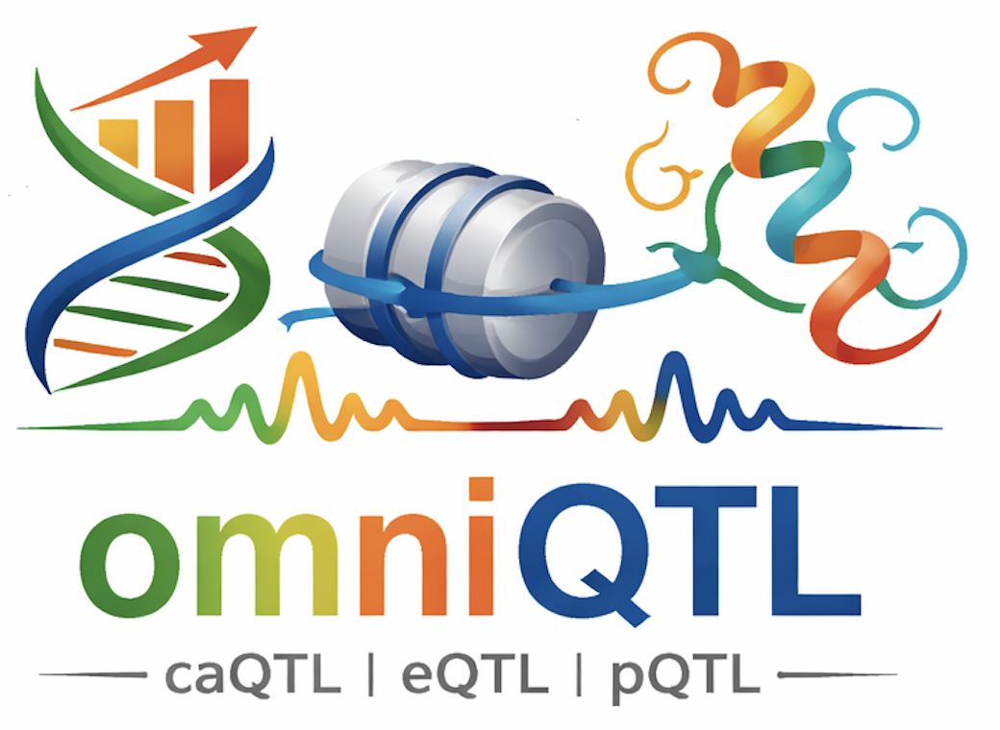

<p align="left">

</p>

## Overview

**omniQTL** is a Python package designed at the [Translational Genomics Lab](https://med.stanford.edu/genomics-of-diabetes.html), lead by Dr. Anna Gloyn at Stanford University, for robust and reproducible quantitative trait loci (QTL) mapping across multiple molecular phenotypes, including caQTL, eQTL, and pQTL. It provides a unified framework that spans the entire analysis pipeline — from quality control of genotyping and sequencing data, to QTL mapping (nominal, permute, and conditional) based on QTLtools, and downstream analyses such as colocalization with GWAS summary statistics and visualization, including locus zoom plots and genome tracks. By integrating multi-level molecular phenotypes, omniQTL enables a deeper understanding of the genetic architecture underlying complex traits and diseases.

## Installation

```
git clone git@github.com:HaniceSun/omniQTL.git
conda env create -f environment.yaml
conda activate omniQTL
```

## Usage

```
omniQTL --help
```

## Author and License

**Author:** Han Sun

**Email:** hansun@stanford.edu

**License:** [MIT License](LICENSE)
